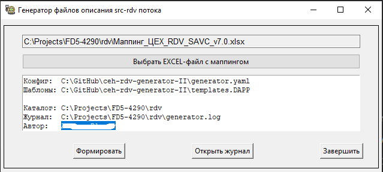

# Генератор артефактов потоков RDV на основе маппинга

"Лежит" здесь: https://github.com/RedPank/ceh-rdv-generator-II

## Описание
Генератор, на основе данных в формате EXCEL, формирует файлы описания потоков RDV: 
 * Скрипт, в формате SQL, для создания целевой таблицы;
 * Описание ресурса целевой таблицы в формате json;
 * Описание ресурса хаб - таблицы в формате json (если необходимо);
 * Описание ресурса БК - схемы хаб - таблицы в формате json (если необходимо);
 * Описание ресурса для таблицы - источника в формате json;
 * Файл рабочего потока в формате скрипта python;
 * Файл управляющего потока в формате yaml;
 * Файл описания целевой таблицы в формате yaml;
 * Файл описания хаб-таблицы в формате yaml (если необходимо);
 * Файл описания таблицы-источника;
 * Файл описания рабочего потока в формате yaml.

На основе сформированных файлов в AirFlow создаются управляющий и рабочий потоки для загрузки данных из 
таблицы - источника в целевую MART-таблицу.   

## Установка
Для работы требуется **Python 3.12** версии и выше

1. Клонировать репозиторий на локальный ресурс (диск)
2. Открыть терминал и создать в папке виртуальное окружение
```bash
py -m venv venv 
# или 
python -m venv venv
```
3. Перейти в режим виртуального окружения при помощи запуска скрипта (важно, чтобы запуск скрипта был именно через **cmd**, на не через PowerShell). Если в начале командной строки появилась надпись **(venv)**, то переход в виртуальное оркужение произошёл успешно.
```bash
.\venv\Scripts\activate.bat
```
4. Установить необходимые зависимости для виртуального окружения с помощью команды
```bash
py -m pip install -r requirements.txt 
# или
python -m pip install -r requirements.txt
```
5. Для проверки запуска программы необходимо выполнить команду:
```bash
py main.py 
```

Если все пункты выполнены успешно - **Вы великолепны!**

**А лучше установить PyCharm Community Edition, через него клонировать репозиторий, установить python и все необходимые библиотеки**

## Файл конфигурации
Перед началом работы рекомендуется изменить файл конфигурации "под себя".

Файл конфигурации `generator.yaml` "по умолчанию" находится рядом с модулем main.py. 

Для работы с разными проектами потоков, возможно, понадобится настроить отдельный файл конфигурации для каждого проекта.

Для указания пути до конфигурационного файла можно использовать опцию "-c имя_файла" при запуске программы. 

Пример:
```bash
python.exe -m main -c C:\FD5-0001\generator.yaml 
```
Если для работы используется программа PyCharm Community Edition, то опция указывается в конфигурации запуска программы.

**Внимание:** Если в файле конфигурации указывается каталог, то символ "\" дублируется: "\\". 

Пример:
```bash
out_path: "C:\\Projects\\FD5-4290\\rdv"
```

 * В секции "Ссылки/Якоря" изменить значения ссылок: 
   * anchor_author - автор проекта
   * anchor_team - команда, работающая над проектом
   * anchor_subo - Слой устойчивых бизнес операций
   * anchor_area - Предметная область
   * anchor_subo_name - полное название СУБО
 * Указать значение переменной `templates`, которая указывает на каталог с шаблонами.
Если в переменной указан относительный путь (без указания "корня" каталога), то считается, что каталог с шаблонами находится "рядом" с фалом main.py
 * Указать каталог для формирования фалов описания потоков в переменной `out_path`
 * Настроить/убрать фильтр `wf_templates_list` 
 * Указать значение переменной `processed_dt` - имя поля в таблице-источнике, на основании которого поток выбирает данные по времени последней загрузки.
 * Указать полный путь до EXCEL-файла маппинга в параметре `excel_file` 
Более подробное описание находится внутри файла конфигурации.
 * Настроить, если необходимо, программу для просмотра журнально файла в переменных `log_viewer` и `log_file_cmd`. По умолчанию используется программа Notepad++.
 * В секции `wf_templates_list` указать список потоков, которые будут обрабатываться.

## Файл маппинга
*Внимание:* 
* Использование фильтров в файле EXCEL, из которого будут загружаться данные, нежелательно, 
т.к. это может привести к непредсказуемым ошибкам.
* Обрабатываются только 2 листа EXCEL: `'Перечень загрузок Src-RDV'` и `'Детали загрузок Src-RDV'`.
* Названия колонок на английском языке должны находится во 2-ой строке EXCEL. В первой строке находятся названия колонок на русском языке.
Первая строка игнорируется при загрузке данных.
* Порядок расположения колонок на листе не имеет значения.
* Формулы в колонке "Expression" задаются в ТЕКСТОВОМ виде, а не виде формул, которые EXCEL рассчитывает. 
* Синтаксис формул должен соответствовать синтаксису PostgreSql.
Например, формула расчета src_cd будет выглядеть так: `'='SAVC'` или `''SAVC'` (первая кавычка сообщает EXCEL, что это текстовое поле). 
Знак '=' в начале - не является обязательным.
* Если заполнена ячейка "Expression", то ячейка "Src_attr" должна быть пустой.

## Окно программы
При запуске программы отображается диалог:



Диалог содержит следующие элементы:
 * `Выбрать EXCEL-файл с описанием данных` - открывает диалог выбора файла для получения пути к 
EXCEL - файлу с описанием алгоритма загрузки данных из источника в целевую таблицу;
 
 * `Формировать` - выполнить операцию формирования фалов описания потока;
 * `Открыть журнал` - открыть во внешней программе журнал формирования файлов потока.  
 * `Завершить` - Завершить работу с программой.

## Целевые файлы (результат)
Программа помещает результат работы в каталог заданный в фйле конфигурации в переменной `out_path`. 
Внутри каталога `out_path` создаются подкаталоги потоков, названные по имени рабочего потока.
Структура каталогов с файлами потока аналогична структуре каталогов репозитория
через который происходит публикация наработок (ceh-ddl, ceh-etl).

В каталог ```src``` помещаются файлы, которые могут понадобиться для создания вспомогательных объектов потока:
* Скрипты для создания акцессоров целевых таблиц
* Скрипты для создания hub-таблиц
* Ресурсы hub-таблиц
* Файлы описания hub-таблиц


```
Каталог потока
├───ceh-ddl
│   └───extensions
│       └───ripper
│           └───.data
├───ceh-etl
│   ├───general_ledger
│   │   └───src_rdv
│   │       ├───dags
│   │       ├───flow_dumps
│   │       └───schema
│   │           ├───ceh
│   │           │   └───rdv
│   │           ├───db_tables
│   │           └───work_flows
│   └───_resources
│       ├───ceh
│       │   └───rdv
│       └───uni
└───src
    ├───ceh-ddl
    │   └───extensions
    │       └───ripper
    │           └───.data
    └───ceh-etl
        ├───general_ledger
        │   └───src_rdv
        │       └───schema
        │           └───ceh
        │               └───rdv
        └───_resources
            └───ceh
                └───rdv

```


## Изменения

____________________
#### Список 1
Файл конфигурации содержит следующие настройки:
   * Имя автора
   * Название команды проекта
   * Название СУБО
   * Название Предметной области
   * Каталог с файлами шаблонов (по умолчанию "templates", находящийся "рядом" с main.py)
   * Программа для просмотра журнального файла
   * Каталог для сохранения сформированных фалов
   * Набор строк для формирования секции tags в файлах wf_\*.yaml, cf_\*.yaml
   * Список названий полей, которые НЕ будут использоваться для формирования hash
   * Список полей, которые НЕ включаются в опцию distributed_by / multi_fields
   * Список полей целевой таблицы, которые НЕ будут добавлены в секцию field_map шаблона wf_\*.yaml
   * Список полей с описанием, которые БУДУТ добавлены в секцию field_map шаблона wf_\*.yaml
   * Список предопределенных "связок" поле - тип поля для целевой таблицы, 
   для выполнения проверки типов "технических" полей
   * Список возможных значений колонки "Tgt_attr_datatype", для выполнения проверки данных в EXCEL
   * Список возможных значений колонки "Src_attr_datatype", для выполнения проверки данных в EXCEL
   * Список имен колонок на листах файла EXCEL, которые должны присутствовать, для выполнения проверки данных в EXCEL   *
   * Колонка Expression может содержать выражение PostgreSQL (начинается со знака "=")
   
#### Список 2
 * Добавлено формирование файлов:
   * Описание хаб-таблиц (yaml)
   * Описание "корневого" ресурса хаб-таблиц (json)
   * Описание ресурса хаб-таблиц (json) для БК-схем
 
#### Список 3 (11.01.2024)
* В файл конфигурации `generator.yaml` в секцию **field_type_list** добавлены тестовые параметры 
  * **src_arrt_name_regexp** - Шаблон названия поля в таблице-источнике
  * **tgt_arrt_name_regexp** - Шаблон названия поля в целевой таблице
* Добавлена проверка: Поля целевой таблицы, отмеченные как 'pk' должны иметь признак 'not null'
* Поля, целевой таблицы, отмеченные одновременно как 'pk' и 'hub' не включаются в секцию `multi_fields` файла mart_*.yaml
* Добавлено формирование скриптов создания и начальной инициализации hub-таблиц. Скрипты вынесены в отдельный каталог, 
т.к. решение об их исполнении принимает разработчик  
____________________

#### Список 4 (11.02.2024)
* Реализована возможность создавать разные конфигурации для разных "источников" через указание файла конфигурации и каталога шаблонов.
В дистрибутиве присутствуют каталоги шаблонов для двух источников: ODS И DAPP  
Для настройки "своей" конфигурации необходимо:
  * Скопировать в каталог проекта файл настроек generator.yaml 
  * Скопировать в каталог проекта файл start_process.bat 
    * В start_process.bat прописать пути до файлов 
      * activate.bat (находится в каталоге venv\Scripts)
      * main.py
      * generator.yaml
  * В файле `activate.bat` добавить обработку параметров командной строки при вызове python, как показано ниже  
  * Выполнить "точную" настройку generator.yaml для Вашего источника.
  Обязательно прописать **полный** путь к каталогу с шаблонами!
  * При необходимости можно скопировать шаблоны в новый каталог, сделать изменения и прописать путь в generator.yaml.
  
`start_process.bat:`
```
Полный_путь_до_каталога\ceh-rdv-generator\venv\Scripts\activate.bat  Полный_путь_до_каталога\ceh-rdv-generator\main.py -c полный_путь_до_файла\generator_ods.yaml 
```  
`activate.bat:`
```
Полный_путь_до_каталога\python.exe %1 %2 %3 %4 %5 %6 
```
---

* Имя источника данных берется из колонки "Источник данных (транспорт)" (Source_name) листа "Перечень загрузок Src-RDV".
Ранее источник данных задавался в диалоге
* В файл конфигурации `generator.yaml` добавлены параметры:
  * **excel_file** - Имя EXCEL - файла, которое будет подставляться в поле диалога, при запуске программы  
  * **field_type_list->src_cd_regexp** - Шаблон Кода Источника (Колонка "Expression", поле src_cd)
  * **setting_up_field_lists->hdp_processed** - Поле даты в источнике, по которому будет выполняться фильтрация новых записей.
  Используется в шаблоне mart.yaml для установки параметра "history_field"  
  _Имя параметра не имеет никакого смыслового назначения, кроме обозначения самого параметра!_
  * **setting_up_field_lists->hdp_processed_conversion** - признак округление даты (second/day). Используется в wf.yaml 
  для задания параметра ф-ии syn_history_function  
* Изменена логика формирования колонки **Tgt_PK**:  
Колонка может содержать несколько признаков, которые вносятся через запятую. Наличие пробелов или других символов исключается.  
Пример: 
  * 'pk,rk'
  * 'pk'
  * В настоящий момент обрабатывается только признак 'pk'. Все остальные значения игнорируются.
  * Значения в колонке могут быть следующие:
    * pk - отмечаются поля, входящие в состав "первичного ключа" таблицы и однозначно определяющие уникальную строку в разрезе историчности.  
    Имена pk-полей передаются в функцию etl.f_gen_access_view для создания акцессоров (кроме полей, названия которых перечислены в секции ignore_primary_key файла конфигурации).  
    * Поля дат историчности, необходимо отмечать как 'pk'. При этом их имена должны быть в списке ignore_primary_key, что-бы не попадать в инструкцию DISTRIBUTED BY оператора CREATE TABLE.   
    * Все pk-поля должны быть "not null".  
    * Если в колонке `"distribution_field"` листа `'Перечень загрузок Src-RDV'` не указано списка полей, то 
    все pk-поля (кроме включенных в список ignore_primary_key) входят в инструкцию DISTRIBUTED BY оператора CREATE TABLE.
    * Если поле, отмеченное как "pk", является так-же полем хаба, то для него устанавливается признак is_bk = true. 
* Добавлен "мягкий" контроль соответствия типов полей источника и целевой таблицы  
Список "пар" типов задается в файле настроек в параметре **field_type_list->corresp_datatype**  
Пара полей (*_id / *_rk), входящих в хаб (если такая имеется) должна иметь типы 'string' / 'bigint', 'integer', 'smallint'
  
#### Список 5 (29.02.2024)
* Добавлен контроль имени БК-схемы
* Добавлен контроль количества hash - полей. Не более 100.

#### Список 6 (20.09.2024)
* Добавлена возможность задавать псевдонимы колонок EXCEL, что устраняет необходимость их переименования (параметр `col_aliases` файла конфигурации). 
Колонка может иметь только один псевдоним. 
* Цикл обработки потоков больше не прерывается, если обнаружены ошибки в описании одного из потоков.
* Добавлен список колонок в шаблон описания ресурса.

#### Список 7 (15.03.2025)
* Все переделано с учетом загрузки нескольких таблиц в одном потоке.
* Название проекта заменено на `ceh-rdv-generator-II`

#### Список 8 (20.03.2025)
* Значение "primary key" заполняется из колонки `'Tgt_PK'` листа `'Детали загрузок Src-RDV'`. 
* Исключаются поля, которые находятся в списке `ignore_primary_key` конфигурационного файла. 
* Значение опции `DISTRIBUTED BY` заполняется из колонки "distribution_field" листа `'Перечень загрузок Src-RDV'`. 
Если колонка пустая, то значение берется из "primary key".
* Имя rk-поля для описания hub-таблиц берется из колонки `'attr:bk_object'`. 
Если имя поля не указано в этой колонке, то имя берется из `'tgt_attribute'`. 
Формат поля `'attr:bk_object'`: `имя_схемы.имя_hub_таблицы.имя_rk_поля`. Пример: `rdv.hub_counterparty_bonus.counterparty_bonus_rk`.
Имя поля может отсутствовать.
* В файл конфигурации добавлен параметр логический `colorlog` (False/True), 
который позволяет добавлять в журнальный файл esc-последовательности для выделения цветом сообщений разных уровней.
Для просмотра требуется внешний редактор распознающий esc-последовательности. 
* Формирование файлов описания hub-таблиц, ресурсов hub-таблиц, скриптов создания hub-таблиц вынесено в каталог `src` 
для предотвращения случайной замены этих файлов на сервере, если они уже были созданы в других проектах.  

#### Список 9 (04.05.2025)
* В файл конфигурации добавлен параметр `src_datatype_aliases`, который задает пары значений:
`Тип данных в "Src_attr_datatype"` : `"Правильный" тип`. 
При считывании данных их файла маппинга EXCEL выполняется замена значений в колонке `Src_attr_datatype` на значение `"Правильный" тип` из параметра.
Например, все значения "string" будут заменены на "text" из-за наличия в параметре пары **'string': 'text'**.


#### Список 10 (08.06.2025)
* Убрал в диалоге возможность выбора EXCEL - файла. Имя обрабатываемого файла берется из generator.yaml, параметр `excel_file`.